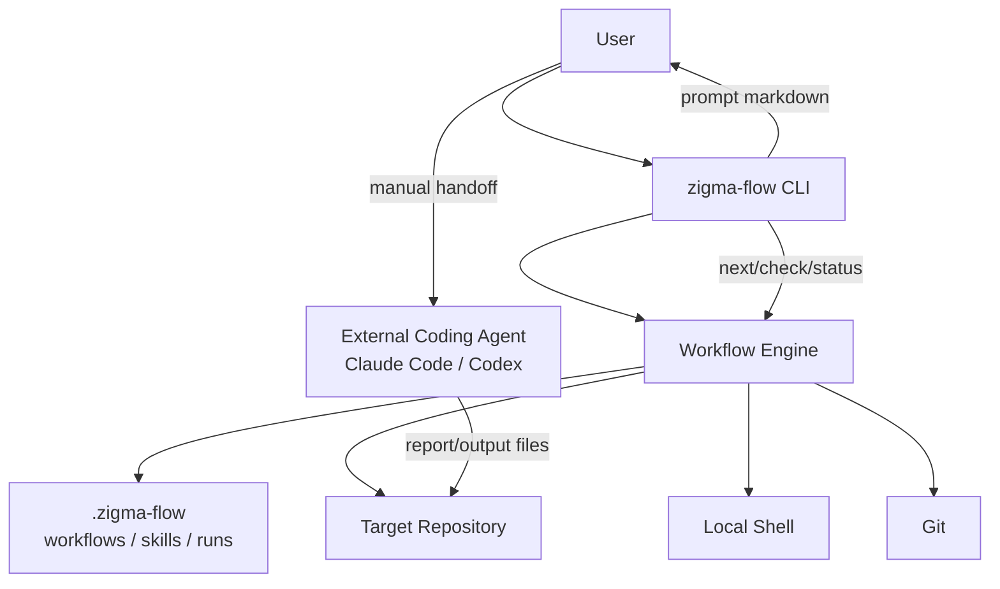

# Zigma Flow MVP Architecture

文档版本：v0.1（含 v0.2 修订增量，2026-06-27）
日期：2026-06-06
适用范围：Zigma Flow PRD v0.3 + v0.2 修订增量；v0.2 修订集中在 §5.2、§6.2、§7.1、§7.2

> **v0.2 修订总览（2026-06-27）：** 为承载 P13 引入的三类 Agent 主动控制流能力（结构化返回状态、workflow 变量与上下文块、条件/跳转/有界循环），架构在以下位置扩展：
>
> - §5.2 模块边界：补充 `engine` 中的三个新入口（applyContextPatch、applyStatusReturn、evaluateStepCondition），并扩展 `context` 与 `expression` 的责任面。
> - §6.2 聚合与不变量：增加 Variables 与 ContextBlock 聚合的不变量；明确状态机字段与数据层命名空间的隔离边界。
> - §7.1 Engine 入口清单：追加新入口。
> - §7.2 状态转换规则：补充 Step `pending → skipped`（via `if`）与 `running → blocked`（via `max_visits`）转换；补充 `awaiting_human` 状态（由 P15 引入，前置预告）。
>
> 设计目的与权衡详见 `docs/phases/p13-agent-adapter-hardening/02-development-plan.md §1 §3 §4`。

## 1. 设计结论

Zigma Flow MVP 采用本地单进程 TypeScript CLI 的模块化单体架构。核心运行时以 Workflow、Job、Step、Skill Pack、Artifact、Signal、Gate 和 Event 为领域模型，Engine 是唯一状态推进者，Agent 只能提交结构化结果和 signal，不能直接修改 workflow 状态。

架构目标不是构建通用工作流平台，而是验证一个本地 Agent Workflow Runtime 的最小可行内核：

- Workflow 负责编排流程、DAG、状态转移、optional job、retry 和 failure。
- Step 是统一执行单元，可以是 agent、script、check、router、workflow 或 human。
- Skill Pack 是能力包，只提供 knowledge、prompt、tool、script、check、function、policy、example 和 workflow template。
- Context Builder 控制 Agent Step 可见上下文，Prompt Builder 只负责渲染。
- Script Runner 和 Check Runner 接管确定性动作和确定性 gate。
- Event Logger 记录每次状态变化，State Store 保存当前快照。
- Artifact Manager 用 artifact 引用承载日志、diff、report 和运行产物，避免 prompt 膨胀。

## 2. 已确认事实与约束

来源：`docs/prd.md` v0.3 和 `docs/temp/修正意见.md`。

已确认事实：

- 仓库当前是文档起步状态，尚未有实现代码。
- MVP 是本地 CLI，不做 Web UI、服务端平台、多租户或远程 registry。
- MVP Agent Step 采用半自动模式：工具生成 prompt，由用户交给 Claude Code、Codex 或其他 Agent。
- Engine 本地执行 script、check、router，并维护 run state、event log 和 artifacts。
- Job 层用 `needs` 表达 DAG，optional job 默认 inactive，由 signal 或 router 激活。
- Agent 只能输出 signal，Engine 通过 Gate 裁决流程变化。
- MVP 不实现真正动态插入 job、任意循环、运行时 YAML patch、Docker、MCP runtime、PR 自动化和完整 event sourcing 重建。
- 推荐实现技术栈是 TypeScript CLI，生态依赖包括 commander、yaml、zod 或 ajv、execa、simple-git、vitest 和 tsup。

关键架构约束：

- Agent 不能修改 `.zigma-flow/runs/*/state.json`。
- Workflow DSL 不能演化成通用编程语言。
- Skill Pack 不能接管流程状态。
- 所有状态变更必须可审计。
- 只读 job 不应修改工作区。
- MVP 同一时刻最多允许一个 writable job running。

工作假设：

- MVP 优先支持单用户、本地仓库、本地文件系统。
- 多个 ready read-only jobs 可以被列出和顺序执行，但不需要自动并发调度 Agent。
- Event log 从第一版按可重建状态设计，但 MVP 只要求 state snapshot 是运行时读取的当前状态。

## 3. 方法选择

Primary subskills:

- Modular Monolith：当前部署形态是本地 CLI，独立服务部署、团队自治和服务级扩缩容都不是 MVP 驱动。模块化单体可以约束边界，同时保持实现成本低。
- Clean and Hexagonal Architecture：核心 Engine 需要独立于 commander、execa、simple-git、文件系统细节和终端输出，方便测试状态推进、DAG、signal、router 和 retry。

Supporting subskills:

- Domain-Driven Design：PRD 的主要复杂度来自 Workflow、Job、Step、Skill Pack、Artifact、Signal、Gate 等概念边界，需要明确领域语言和聚合边界。
- Quality-Attribute Design：稳定性、可审计性、可移植性、安全性和可扩展性是 MVP 成败标准，必须转成可测试场景。

Rejected methods:

- Microservices：没有独立部署、远程流量、团队拆分或服务级隔离需求。
- CQRS：MVP 的读写模型没有显著分化，CLI query 可以读取同一 state snapshot 和 event log。
- Full Event Sourcing：PRD 明确暂不做完整 event sourcing 重建。MVP 记录事件并保留未来重建条件。
- Arbitrary Workflow Programming Language：PRD 明确禁止 while、for、任意表达式副作用和 runtime YAML patch。

## 4. 系统上下文



边界说明：

- Zigma Flow 不拥有目标仓库代码，只检查、读取或按 workflow 权限允许 Agent 修改目标仓库。
- 外部 Agent 不是 MVP runtime 的子进程。Agent Step 的执行边界是 prompt 生成和 report 接收。
- 本地 shell 和 git 是基础设施适配器，不能泄漏进核心状态机规则。
- `.zigma-flow/runs` 是 run 数据、artifact、event 和 state 的唯一持久化目录。

## 5. 目标架构

### 5.1 逻辑层

```text
CLI Layer
  commands, terminal formatting, exit code mapping

Application Layer
  init, validate, run, status, prompt, step, check, next, retry, abort use cases

Runtime Core
  workflow model, skill-pack model, DAG, engine, state transition, signal, router, retry

Context and Artifact Layer
  context builder, prompt builder, artifact metadata, artifact summaries

Infrastructure Adapters
  filesystem store, event writer, process runner, git inspector, clock, id generator
```

依赖方向：

```text
CLI -> Application -> Runtime Core
Application -> Context/Artifact
Application -> Infrastructure ports
Infrastructure adapters -> Infrastructure ports

Runtime Core must not import CLI, commander, chalk, execa, simple-git, or concrete fs helpers.
```

实践上可以沿用 PRD 的 `src/*` 目录命名，但必须遵守上面的依赖方向。

### 5.2 模块边界

| 模块 | 责任 | 禁止事项 |
| --- | --- | --- |
| `cli.ts` / `commands` | 解析命令、调用 use case、格式化输出、设置 exit code | 不直接改 state，不直接执行 workflow 逻辑 |
| `workflow` | 加载和校验 workflow YAML，输出 WorkflowDefinition | 不读取 run state，不执行 step |
| `skill-pack` | 加载 skill.yml，解析 skill-lock，校验 export path 和 hash | 不改变 workflow 状态 |
| `dag` | 校验 needs、optional_needs、循环依赖，计算 ready jobs | 不访问文件系统 |
| `engine` | 解释状态机，推进 step/job/run，处理 signal、router、retry、activation；**v0.2**：处理 status return（applyStatusReturn）、context patch（applyContextPatch）、step `if` 求值（evaluateStepCondition）、goto_step 跳转、max_visits 守门 | 不直接调用 execa、simple-git 或 terminal 输出；**v0.2**：不允许 patch 触及状态机字段（jobs/signals/attempts/last_event_id 等），保留字段在 engine 代码中硬编码 |
| `context` | 根据当前 Agent Step、inputs、artifacts、expose 和 permissions 组装上下文；**v0.2**：根据 step 权限按白名单注入 variables 与 context_blocks（read），并标注可写性（write） | 不决定状态转移；**v0.2**：不绕过 step.permissions.variables / context_blocks 白名单 |
| `prompt` | 将 context 渲染为 Markdown prompt | 不读取未授权资源 |
| `script` | 执行 inline command 或 Skill Pack script，生成 ScriptResult | 不解释业务状态，只返回结果 |
| `check` | 执行确定性检查，生成 CheckResult | 不调用 LLM Judge 作为基础 gate |
| `artifact` | 分配 artifact 路径，写入 metadata，生成摘要；**v0.2**：管理 `context_block` artifact 的版本化目录（v1/v2/...） | 不删除历史 artifact |
| `run` | 创建 run 目录，读写 state snapshot，管理 active run；**v0.2**：state.json 增 variables / context_blocks 段、JobState 增 step_visits | 不绕过 engine 写状态 |
| `events` | 追加 events.jsonl，定义事件 schema；**v0.2**：暴露 `nextSequentialEventId(runDir)` 端口，统一事件号分配 | 不把事件当终端展示格式 |
| `workspace` | 检查 read-only/writable 规则、路径安全和工作区修改 | 不修复或回滚用户代码 |
| `git` | 读取 diff、changed files、repo status | 不直接决定 check pass/fail |
| `expression` | 解析受限 `${{ ... }}` 插值；**v0.2**：扩展支持 `variables.<name>`、`jobs.<id>.outputs.<key>`、`steps.<id>.outputs.<key>` 命名空间；支持等值/逻辑组合（`==` / `!=` / `&&` / `||` / `!`）用于 `if:` 与 router switch | 不支持任意脚本执行；**v0.2**：仍禁止函数调用、算术、字符串拼接、JS 求值 |
| `utils` | 稳定错误类型、路径安全、轻量通用工具 | 不放业务规则 |
| `agent` | **v0.2 已存在**：定义 AgentBackend 接口，注册 backend factory，加载 backend 配置；调用子进程 | 不解释业务状态；不直接改 state（失败/超时/取消通过 engine 入口 recordAgentFailure 落盘） |

### 5.3 源码布局建议

PRD 已给出细粒度目录。本架构建议保留该布局，并补充一条实现规则：每个目录只暴露 `index.ts` 或少量 public API，测试只能依赖 public API，除白盒单测外不得跨目录读取 internal 文件。

```text
src/
  cli.ts
  commands/
  workflow/
  skill-pack/
  dag/
  engine/
  context/
  prompt/
  script/
  check/
  artifact/
  run/
  workspace/
  git/
  events/
  expression/
  utils/
```

建议新增接口放置原则：

- 由核心用例需要的接口放在使用方附近。例如 `engine` 需要 `StateStore`，接口定义可以放在 `engine/ports.ts` 或 `run/stateStore.ts` 的 public API。
- 具体适配器放在能力目录内。例如 `script` 中可以有 `ExecaScriptRunner`，但 engine 只依赖 `ScriptRunner` 接口。
- 不为纯函数 helper 创建端口。只有文件系统、进程、git、clock、id generator、terminal 这类外部或易变依赖需要端口。

## 6. 领域模型

### 6.1 Bounded Contexts

| Context | 核心概念 | 所有权 |
| --- | --- | --- |
| Workflow Definition | Workflow、JobDefinition、StepDefinition、SignalDefinition、PermissionPolicy | workflow loader 和 schema validator |
| Skill Pack | SkillPack、SkillExport、SkillLock、AgentFunction、Policy | skill-pack loader 和 lock resolver |
| Run Runtime | Run、JobRun、StepRun、Attempt、StateTransition、GateDecision | workflow engine |
| Artifact and Event | ArtifactMetadata、ArtifactRef、Event、EventStream | artifact manager 和 event logger |
| Workspace Safety | WorkspaceMode、ChangedFiles、ForbiddenPath、PathPolicy | workspace guard、git inspector、check runner |
| Agent Context | ContextBundle、ExposedCapability、PromptDocument、ReportSchema | context builder、prompt builder |

### 6.2 Aggregates and invariants

WorkflowDefinition:

- `name` 和 `version` 必须存在。
- job id 在 workflow 内唯一。
- step id 在同一 job 内唯一。
- `needs`、`optional_needs` 必须引用存在 job。
- DAG（job 层）不允许循环。
- optional job 必须声明 `activation: optional`。
- step type 只能是 MVP 允许集合。
- Agent Step 的 `expose` 只能引用 workflow 顶层声明的 skills。
- **v0.2**：`step.if` 表达式只能使用受限语法（等值/逻辑组合 + `${{ ... }}` 插值）。
- **v0.2**：`router.goto_step` 目标必须存在于同 job；step 层允许形成环（由 `max_visits` 兜底）。
- **v0.2**：`step.returns.status.values` 必须非空数组；`step.on_return` 的 key 必须是 `returns.status.values` 的子集。
- **v0.2**：workflow 顶层 `variables.<name>.allowed_writers` 与 `context_blocks.<id>.allowed_writers` 必须引用存在 step（`<job>.<step>` 或 `<job>.*` 通配）。
- **v0.2**：step `permissions.variables.write` 与 `permissions.context_blocks.write` 必须是 workflow 顶层对应 `allowed_writers` 的子集（双重校验）。

SkillPack:

- `kind` 必须是 `skill-pack`。
- 所有导出 path 必须存在且位于 Skill Pack 目录内。
- Skill Pack 不允许声明 workflow 状态转移。
- lockfile 记录 resolved path、version 和 content hash。

Run:

- run id 唯一，run 目录不可复用。
- optional job 初始状态为 inactive。
- required job 根据 DAG 初始化为 waiting 或 ready。
- `state.json` 只能由 Engine 写入。
- 每个状态变化都必须对应 event。
- **v0.2**：state.json 的状态机字段（`run_id`、`workflow`、`status`、`last_event_id`、`signals` 注册表、`jobs[*]` 的所有字段）只能由 Engine 内部入口写入；patch 类操作（applyContextPatch）一律拒绝触及。
- **v0.2**：state.json 的数据层段（`variables`、`context_blocks`）可由 Engine applyContextPatch 入口写入；与状态机字段隔离。

JobRun:

- completed job 不应被重新执行，除非 Engine 执行合法 retry transition。
- retry 必须增加 attempt，并保留历史 attempt artifacts。
- retry 超过 `max_attempts` 后进入 blocked 或 failed，按 workflow 声明执行。
- writable job 同时 running 数量最多为 1。
- **v0.2**：`step_visits` 计数随 step 进入递增；超过 `max_visits` → step 与 job 进入 blocked。
- **v0.2**：retry（attempt + 1）必须清零 `step_visits`；不允许通过 patch 或外部输入重置。

StepRun:

- Agent Step 只生成 prompt 和接收 report。
- Script Step 必须记录 stdout、stderr、exit_code 和 timeout 结果。
- Check Step 必须产出 check-result artifact。
- Router Step 不调用 Agent，不执行任意脚本。
- **v0.2**：Agent Step 接收的 report 按固定流水线处理（context_patches → status → signals → advance），任一阶段失败整批回滚。
- **v0.2**：`if:` 求值 false → step 状态 `skipped`；不消耗 visit 计数。
- **v0.2**：`router.goto_step` 触发后，目标 step 状态重置为 `pending`，visit 计数 +1；本身不增 attempt。

Signal:

- signal type 必须在 workflow 顶层声明。
- signal 必须来自 allowed step/job。
- Agent 只能请求流程变化，不能指定最终状态写入。
- Engine 按 priority 和 gate rule 裁决 action。
- **v0.2**：status 触发的 action 优先于 signals action；signals 仍记录 `signal_received` 事件以备审计。

Variables（v0.2 新增聚合）：

- 变量声明在 workflow 顶层，初始值在 createRun 时写入 state.variables。
- 写入只能通过 applyContextPatch；批次原子。
- `variables.<name>.type` 与 `enum`（若声明）在每次 patch 时严格校验。
- `allowed_writers` 与 step.permissions.variables.write 双重校验，任意一处不通过即拒绝。
- 读取通过 Context Builder 注入 prompt，受 step.permissions.variables.read 白名单约束。

ContextBlock（v0.2 新增聚合）：

- 上下文块声明在 workflow 顶层，初始 artifact（如有）在 createRun 时引用。
- 每次写入产生新版本 artifact（kind=`context_block`，path=`context-blocks/<id>/v<N>.<ext>`）。
- state.context_blocks.<id>.current_version 单调递增，旧版本 artifact 永不被覆盖或删除。
- `allowed_writers` 与 step.permissions.context_blocks.write 双重校验。
- 读取通过 Context Builder 注入 prompt 正文，受 step.permissions.context_blocks.read 白名单约束。

Artifact:

- artifact 必须有 producer、kind、path、content_type、created_at、size 和可选 summary。
- artifact path 必须位于当前 run 目录内。
- artifact 不得被 retry 覆盖。
- report、diff、log、check-result 都以 artifact ref 传递，不直接塞入大字段。

## 7. 状态推进架构

### 7.1 Engine command model

Engine 对外暴露少量命令式入口：

```text
createRun(workflow, inputs)
prepareAgentStep(runId, jobId)
acceptAgentReport(runId, jobId, reportPath)
executeCurrentStep(runId, jobId)
advanceJob(runId, jobId)
retryJob(runId, jobId, reason, retryInputs)
abortRun(runId)
```

CLI 命令只调用这些入口，不直接改 run state。

【v0.2 修订】新增入口（P13）：

```text
runAll(opts)                              # P13 把 commands/run-all 主循环搬进 engine
recordAgentFailure(runId, jobId, ...)     # P13 backend 失败 → retry 路径
cancelRun(runId, reason)                  # P13 SIGINT / AbortSignal 取消
applyContextPatch(runId, jobId, patches)  # P13 写入 variables / context_blocks，批次原子
applyStatusReturn(runId, jobId, status)   # P13 status → on_return action 翻译
evaluateStepCondition(expr, runState)     # P13 step.if 表达式求值（纯函数，可单测）
```

P15 进一步追加：

```text
enterHumanGate(runId, jobId, stepId)
recordHumanDecision(runId, jobId, stepId, decision, ...)
```

所有新入口仍遵守 §7.1 既有约束：CLI 不直接改 state，所有写入走 StateStore + EventWriter；patch 类入口拒绝触及保留字段。

### 7.2 状态转换规则

Run status:

```text
created -> running -> completed
created -> running -> blocked
created -> running -> failed
created -> running -> cancelled
```

Job status:

```text
inactive -> waiting -> ready -> running -> completed
inactive -> ready
ready -> running -> failed
ready -> running -> blocked
completed -> retrying -> ready
running -> cancelled
waiting -> skipped
```

Step status:

```text
pending -> running -> completed
pending -> running -> failed
pending -> skipped
completed -> retrying -> pending
```

【v0.2 修订】Step status 新增/扩展转换：

```text
pending -> skipped                  # 增强：via step.if 求值 false（写 step_skipped 事件）
running -> blocked                  # 新增：via step_visits 超过 max_visits（写 step_visit_exceeded）
completed -> pending                # 新增：via router goto_step（写 step_revisited，visit 计数 +1）
running -> awaiting_human           # 新增（P15 预告）：进入 human step 时
awaiting_human -> completed         # 新增（P15）：approve
awaiting_human -> failed            # 新增（P15）：reject 且无后续 router
awaiting_human -> cancelled         # 新增（P15）：Ctrl-C / abort
```

非法转换必须返回明确错误，并且不得写入 snapshot。

【v0.2 修订】Run status 新增：

```text
running -> cancelled                # 增强：经 cancelRun 触发，写 run_cancelled 事件
```

`cancelled` 是终态，与 `completed` / `failed` / `blocked` 同级；恢复需 `--resume` 启动新主循环。

### 7.3 Event and snapshot persistence

MVP 采用 event log 加 state snapshot：

- `events.jsonl` 是审计事实流。
- `state.json` 是当前运行快照。
- 每个状态变更生成稳定 event id。
- `state.json` 必须记录 `last_event_id`。
- 写入流程为：计算 transition，追加 event，写 `state.json.tmp`，原子替换 `state.json`。
- 启动时如果 `state.last_event_id` 与 event log 尾部不一致，应报出恢复建议，MVP 不自动重建。

该策略不承诺完整 event sourcing，但避免从第一版丢失审计信息。

### 7.4 Concurrency model (v0.2)

P14 引入并发调度，让 read-only jobs 在 `run-all` 中并行执行。核心设计原则：

1. **Scheduler 是纯函数**（`src/engine/scheduler.ts`）：`selectExecutable(state, workflow, config)` 不执行任何 IO。它从 `RunState` 和 `WorkflowDefinition` 中计算出一个 `ExecutableBatch`。输入决定输出——无文件访问、无异步行为。
2. **Read-only 并行，writable 串行**：Read-only jobs 可以同时运行，上限由 `parallelism` 控制。Writable jobs 最多同时运行一个（AD-P14-002）。判定依据是 job 的 `workspace.mode` 字段：`"read-only"` 以外的所有值视为 writable。
3. **AsyncQueue 提供 per-runDir 写串行**（`src/run/asyncQueue.ts`）：`LocalStateStore.writeSnapshot` 和 `JsonlEventWriter.appendEvent` 各自通过 per-runDir 的 AsyncQueue 排队。多个 job 并发写入同一 run 目录时，写操作按 FIFO 顺序执行，不会出现部分写或行交错。
4. **`updateState` 原子 read-modify-write**：AsyncQueue 内调用 `updateState(fn)`，其中 `fn` 以当前 state 快照为输入，返回新 state。read-modify-write 在同一队列任务中连续完成，不会被其他写操作打断。
5. **Event ID 全局单调**：`nextSequentialEventId` 通过 `events.jsonl` 确定下一个 ID。同批次所有并发 job 都经过同一个 AsyncQueue 写事件，因此事件 ID 仍是全局严格递增的。
6. **`batch_id` 事件分组**：每个调度批次生成一个 `randomUUID()` 作为 `batch_id`，该批次所有事件（`step_started`、`step_completed`、`agent_invoked` 等）的 payload 都包含此 ID。回放工具可按 `batch_id` 分组，识别同批次并发 job。

**Batch execution loop（AD-P14-004）：**

```text
while (not terminal and iterations < MAX) {
  state = stateStore.readSnapshot(runDir)
  batch = selectExecutable({ state, workflow, config })  // pure function
  if (batch.jobs is empty) break

  batchId = randomUUID()  // AD-P14-006: shared batch_id

  // Create per-job AbortControllers (fail-fast support)
  for each job in batch.jobs:
    controller = new AbortController()
    link external signal to controller

  // Dispatch all jobs concurrently (AD-P14-004)
  results = Promise.allSettled(
    batch.jobs.map(j => executeJobOnce(ctx, j, batchId))
  )

  // Post-batch: state re-read at top of next iteration
  iteration++
}
```

**Fail-fast（AD-P14-005）：**

- `failFast = false`（默认）：同批次单个 job 失败不影响其他 job。失败 job 走 `recordAgentFailure` 进入 retry 路径；其余 job 正常完成。
- `failFast = true`：第一个 job 失败后，立即 abort 同批次其余所有 job 的 AbortController。被中断 job 写入 `agent_cancelled` 事件（`reason = "fail_fast"`），不进入 retry 计数。

**Scheduler rules applied per iteration（AD-P14-001）：**

1. 收集 `state.jobs` 中 `status === "ready"` 的所有 job。
2. 检查是否有 writable job 正在运行。若有 → 本批次仅允许 read-only jobs。
3. 从 ready pool 中取 read-only job，上限为 `parallelism - running_read_only_count`。
4. 如果 read-only 未填满 parallelism 且没有 writable 在运行，从 ready pool 中取最多 1 个 writable job。
5. 返回 `ExecutableBatch`（可能为空）和人类可读的 `rationale`。

**默认 parallelism = 4（AD-P14-007）：**

配置优先级：CLI `--parallelism N` > `.zigma-flow/config.json` `agent.parallelism` > `DEFAULT_PARALLELISM = 4`。实际 batch size = `min(parallelism, ready 队列长度)`。

**状态演变（v0.2 新增）：**

```text
非终态 run → 纯函数 scheduler 选择批次 → 并发执行 → (可选 fail-fast abort) → 聚合结果 → 读最新 snapshot → 下一轮
```

Reader/writer 分离：
- **Reader**：`selectExecutable`、`readSnapshot`——无锁并发。
- **Writer**：`writeSnapshot`、`appendEvent`——AsyncQueue 串行化。

## 8. 数据所有权与持久化

### 8.1 目录所有权

```text
.zigma-flow/
  config.json                 owned by init/config
  skill-lock.json             owned by skill-pack lock resolver
  workflows/                  owned by user, read by workflow loader
  skills/                     owned by user, read by skill-pack loader
  runs/                       owned by runtime
```

`runs/<run-id>/` 内：

| 文件或目录 | Owner | 说明 |
| --- | --- | --- |
| `run.yml` | run module | 创建时写入，不应被后续 command 改写核心字段 |
| `state.json` | engine via state store | 当前状态快照 |
| `skill-lock.snapshot.json` | run module | 本次运行使用的 skill lock 快照 |
| `events.jsonl` | event logger | append-only |
| `artifacts.jsonl` | artifact manager | run 级 artifact index |
| `jobs/<job>/attempts/<n>/steps/<step>/` | artifact manager | step 产物目录 |

### 8.2 Artifact contract

artifact metadata 最小结构：

```json
{
  "id": "artifact://20260606-0001/jobs/unit-test/attempts/1/steps/test/stdout",
  "run_id": "20260606-0001",
  "producer": {
    "job": "unit-test",
    "step": "test",
    "attempt": 1
  },
  "kind": "stdout",
  "path": "jobs/unit-test/attempts/1/steps/test/stdout.log",
  "content_type": "text/plain",
  "size": 10240,
  "summary": "12 tests passed",
  "created_at": "2026-06-06T10:00:00+08:00"
}
```

路径安全规则：

- artifact path 必须相对 run directory。
- 禁止绝对路径。
- 禁止 `..` 越界。
- 禁止 symlink 指向 run directory 外部。
- 用户输入路径进入 artifact 或 output 前必须规范化和校验。

## 9. 集成契约

### 9.1 Workflow YAML

Workflow YAML 是用户配置和 Engine 之间的 published language。Schema validator 必须给出字段级错误。

核心契约：

- 顶层：`name`、`version`、`on`、`skills`、`permissions`、`signals`、`jobs`。
- job：`needs`、`optional_needs`、`activation`、`retry`、`permissions`、`workspace`、`steps`。
- step：`id`、`type`、`uses` 或 `run`、`with`、`outputs`、`on_failure`、`on_pass`、`expose`。
- router 只能使用 `continue`、`fail`、`block`、`retry_job`、`activate_job`、`goto_job`。

### 9.2 Skill Pack manifest

Skill Pack 是能力包 published language。它向 Workflow 和 Agent Step 暴露能力，但不拥有流程状态。

导出集合：

```text
knowledge
prompts
tools
scripts
checks
functions
workflow_templates
policies
examples
```

`functions` 在 MVP 中是 Agent Function 描述，不是任意 runtime 函数调用。真正执行仍由 workflow runtime 或外部 Agent 完成。

### 9.3 Agent report

Agent Step 的输出必须落到约定路径，并通过 schema 验证。

最小 report 形态：

```json
{
  "outputs": {},
  "artifacts": [],
  "signals": [],
  "summary": ""
}
```

规则：

- report 缺失、JSON 不合法或 schema 不匹配时，Agent Step failed 或 blocked，按 workflow gate 处理。
- signal 必须进入 Signal Handler 校验。
- report 中的大文本日志、diff、测试结果应使用 artifact ref。

### 9.4 ScriptResult and CheckResult

ScriptResult:

```json
{
  "exit_code": 0,
  "timed_out": false,
  "stdout": "artifact://...",
  "stderr": "artifact://...",
  "started_at": "...",
  "ended_at": "..."
}
```

CheckResult:

```json
{
  "passed": true,
  "check_id": "code.checks.forbidden-paths",
  "failures": [],
  "artifacts": ["artifact://..."]
}
```

Script Runner 和 Check Runner 只产出结果。是否继续、失败、retry 或 block 由 Engine 和 Gate 处理。

## 10. Quality Attribute Scenarios

| 属性 | 场景 | 响应 | 验收证据 |
| --- | --- | --- | --- |
| 稳定性 | 用户传入非法 workflow YAML | `validate` 返回非零退出码和字段级错误，不创建或修改 run | schema 单测和 CLI 快照测试 |
| 稳定性 | Agent report 缺失必填字段 | Engine 标记当前 step failed 或 blocked，不崩溃，不推进 job | Agent report schema 测试 |
| 可审计性 | 任意状态变化发生 | 写入 events.jsonl，更新 state.last_event_id | event/state 一致性测试 |
| 可恢复性 | state.json 损坏 | CLI 停止推进并提示 event log 不一致或 state 损坏 | 损坏 state fixture 测试 |
| 安全性 | output path 包含 `../../` | validator 或 artifact manager 拒绝 | pathSafe 单测 |
| 安全性 | read-only job 修改工作区 | Workspace Guard 检测 changed files，check failed | 临时 git repo 集成测试 |
| 安全性 | script timeout | ProcessRunner 终止进程，记录 timeout 和 stderr/stdout artifact | timeout 集成测试 |
| 可移植性 | Windows/Linux/macOS 路径差异 | 所有内部路径用规范化相对路径和 file URL 安全规则 | path 测试覆盖 Windows 和 POSIX 样例 |
| 可扩展性 | 未来接入 Agent Adapter | Engine 只依赖 Agent Step contract，不依赖具体 Agent CLI | mock adapter 测试 |
| 可读性 | 生成 Agent prompt | prompt 只含当前 step 允许能力、输出 schema、artifact 摘要和停止要求 | prompt snapshot 测试 |
| 可控性 | Agent 发出 `needs_architecture_design` | Signal Handler 校验 allowed_from，Gate 激活预声明 optional job | signal/router 集成测试 |
| 防循环 | review rejected 多次 retry | attempt 递增，超过 max_attempts 后 blocked | retry 集成测试 |

## 11. 安全与权限策略

MVP 权限模型保持小而硬：

```yaml
permissions:
  contents: read
  edits: none
  commands: none
  workflow_state: none
```

step 或 job 可覆盖为：

```yaml
permissions:
  contents: read
  edits: write
  commands: limited
```

架构规则：

- Prompt Builder 必须把权限和禁止动作渲染进 Agent prompt。
- Runtime 必须用 Workspace Guard 验证只读约束，不能只依赖 prompt。
- `.zigma-flow/runs/*/state.json`、`events.jsonl` 和 lock snapshot 属于 runtime 保护路径。
- Script Step 默认需要 timeout。
- 默认不允许删除项目文件。
- `abort` 只改变 run 状态，不删除运行记录。

### 11.1 Agent Backend Lifecycle (v0.2)

Agent backend 执行遵循固定生命周期，每个调用产生一个事件对：

```
agent_invoked  (backend.execute 之前)
  └─ agent_completed | agent_timed_out | agent_failed | agent_cancelled
```

**调用前：** Engine 记录 `agent_invoked` 事件，payload 含 `backend_name`、`command`、`args_hash`（SHA-256，不含 prompt token）、`timeout_ms`、`step_artifact_dir`。

**调用后：** 根据 backend 返回结果写入对应的终端事件：

| 结果 | 事件 | 关键 payload |
|---|---|---|
| 成功 | `agent_completed` | `duration_ms`, `stdout_artifact`, `stderr_artifact`, `invocation_artifact` |
| 超时 | `agent_timed_out` | `duration_ms`, `timeout_ms`, `stdout_artifact`, `stderr_artifact` |
| 失败 | `agent_failed` | `duration_ms`, `exit_code`, `reason`, `stdout_artifact`, `stderr_artifact` |
| 取消 | `agent_cancelled` | `duration_ms`, `reason` |

**产物落地：** Backend 将 stdout/stderr 写入 `${stepDir}/agent.stdout.log` 和 `${stepDir}/agent.stderr.log`，调用元数据写入 `${stepDir}/agent.invocation.json`。Engine 将这些文件作为 artifact 登记到 `artifacts.jsonl`（kind=`agent_stdout`/`agent_stderr`/`agent_invocation`），不在 error message 中嵌入截尾字符串。

**子进程安全边界：**
- Backend 子进程以 project root 为 cwd，timeout 由 `AgentBackendConfig.timeout` 控制（默认 600s）。
- SIGINT/Ctrl-C 通过 AbortSignal → execa `cancelSignal` → 等待 5s 后强杀。
- 配置类错误（command not found → ConfigError、未登录 → PermissionError）绕过 retry 直接 `run.failed` exit code 4，不重复拉起子进程。

**retry 语义：** agent_failed / agent_timed_out 不直接置 run.failed；Engine 调用 `recordAgentFailure` 按 `JobDefinition.retry` 推进 attempt，达 `max_attempts` 后按 `on_exceeded` 处置。

## 12. MVP Execution Flows

### 12.1 `zigma-flow run`

```text
Command Handler
  -> load workflow
  -> resolve skill lock
  -> validate DAG
  -> create run directory
  -> initialize state
  -> append run_created and job_ready events
  -> write state snapshot
```

### 12.2 `zigma-flow prompt --job <job-id>`

```text
Command Handler
  -> load active run
  -> assert job ready/running and current step is agent
  -> build context from inputs, artifacts, expose, permissions, signals
  -> render prompt markdown
  -> write prompt artifact/current-step.md
  -> append prompt_generated event
```

### 12.3 `zigma-flow step --job <job-id>`

```text
Command Handler
  -> load active run
  -> inspect current step type
  -> script: ProcessRunner executes command
  -> check: CheckRunner evaluates deterministic gate
  -> router: RouterEvaluator selects action
  -> write artifacts
  -> Engine applies transition
  -> append events and write state snapshot
```

### 12.4 `zigma-flow next --job <job-id>`

```text
Command Handler
  -> load active run
  -> accept/validate Agent report if current step is agent
  -> collect outputs/artifacts/signals
  -> Signal Handler validates signal
  -> Gate applies workflow rule
  -> complete step or route transition
  -> resolve next ready jobs
  -> append events and write state snapshot
```

## 13. Implementation Phases

实现顺序应跟 PRD 阶段保持一致，但每一阶段都要留架构验证门槛：

1. CLI skeleton and init
   验证：命令入口薄，`init` 不破坏已有 `.zigma-flow`。

2. Workflow and Skill Pack loader
   验证：schema 错误字段明确，pack 外路径被拒绝。

3. DAG and run creation
   验证：optional job inactive，无依赖 required job ready，event/state 一致。

4. Context Builder and prompt
   验证：prompt 不包含完整 workflow，expose 之外能力不可见。

5. Artifact and event log
   验证：每个 producer 可追溯，retry 不覆盖历史 artifact。

6. Script Step
   验证：timeout、cwd、env、stdout/stderr 和 exit_code 都写入 artifact。

7. Check Step and permission guard
   验证：基础 gate 不依赖 LLM，read-only 修改被检测。

8. Signal, router and optional activation
   验证：未声明 signal 被拒绝，`needs_architecture_design` 只能激活预声明 optional job。

9. Retry job and attempts
   验证：attempt 目录隔离，超过 max_attempts 后 blocked。

10. Built-in code-change workflow
    验证：真实小任务 dogfood，走通 intake、plan、implement、check、review、summarize。

## 14. Risks and Tradeoffs

| 风险 | 取舍 | MVP 决策 |
| --- | --- | --- |
| Workflow DSL 变复杂 | 表达力越高越难审计 | 只支持 PRD 列出的有限控制流 |
| Event log 与 snapshot 不一致 | 文件系统无事务 | event id + atomic snapshot + 启动一致性检查 |
| Script Step 本地执行风险 | 不做 Docker 会降低隔离 | timeout、cwd、env、stdout/stderr、路径检查先行 |
| Agent report 不稳定 | LLM 输出天然不稳定 | schema 校验失败不崩溃，按 gate failed/blocked |
| Skill Pack 与 Workflow 混淆 | 能力包容易承载流程 | Skill Pack 不允许声明状态转移 |
| 单进程 CLI 难以自动并发 | 简化实现但并行能力有限 | MVP 只做 ready jobs 和 writable 互斥，未来再做调度 |
| 文件系统状态膨胀 | artifact/log 可能很大 | metadata + summary 进入 prompt，原文留 artifact |

## 15. ADR Candidates

ADR-001：MVP 采用 TypeScript 本地 CLI 模块化单体。

- 状态：建议接受。
- 原因：符合 PRD 的本地 runtime 定位，降低部署和调试成本。
- 后果：所有模块必须遵守依赖方向，避免 CLI 和基础设施泄漏进核心。

ADR-002：Workflow 拥有流程，Skill Pack 拥有能力。

- 状态：建议接受。
- 原因：避免 Skill Pack 变成隐藏 workflow/action。
- 后果：Skill Pack manifest validator 必须拒绝状态转移声明。

ADR-003：Engine 是唯一状态推进者。

- 状态：建议接受。
- 原因：Agent 只能请求流程变化，Gate 负责裁决，才能保证可审计。
- 后果：CLI、script、check、router 都只提交结果，由 Engine 应用 transition。

ADR-004：MVP 采用 event log 加 state snapshot，不实现完整 event sourcing。

- 状态：建议接受。
- 原因：满足审计和未来重建需要，同时控制 MVP 范围。
- 后果：事件 schema 从第一版稳定设计，state 需要记录 last_event_id。

ADR-005：MVP 使用文件系统 run store，不引入数据库。

- 状态：建议接受。
- 原因：本地 CLI 以可检查、可复制、可回放的目录为核心体验。
- 后果：需要强路径安全、原子写 snapshot 和损坏检测。

ADR-006：MVP 不做自动多 Agent 调度、Docker、MCP、PR 集成。

- 状态：建议接受。
- 原因：这些能力不是验证 Agent Workflow Runtime 内核所必需。
- 后果：架构保留适配器边界，但实现阶段不得提前引入平台复杂度。

## 16. Validation Plan

实现开始后，最小验证集合：

- Unit tests：workflow schema、skill-pack schema、DAG resolver、expression resolver、pathSafe、state transition。
- Contract tests：Agent report、ScriptResult、CheckResult、ArtifactMetadata、Event schema。
- Integration tests：临时 `.zigma-flow` 项目中执行 `init`、`validate`、`run`、`prompt`、`step`、`next`、`retry`。
- Filesystem tests：Windows 和 POSIX 路径样例、atomic state write、artifact 越界拒绝。
- Git workspace tests：read-only job 修改检测、forbidden paths、diff exists。
- Golden prompt tests：prompt 只暴露当前 step 的 skills、functions、knowledge、tools、signals 和 artifact summaries。
- Dogfood acceptance：使用内置 `code-change` workflow 完成一个小型真实修改，证明 review rejected retry 和 `needs_architecture_design` optional activation 可工作。

MVP 架构验收条件：

- 核心状态机测试不需要真实 shell、真实 git 或真实终端。
- `validate` 能阻止无效 workflow 和无效 Skill Pack 进入 run。
- 任一状态变化都能在 events.jsonl 中找到对应 event。
- `state.json` 损坏时 CLI 不继续推进。
- Agent 无法通过 report 直接改写 state。
- Script/Check/Router 的结果都作为 artifact 或 event 可追溯。
- Prompt Builder 输出的人类可读 prompt 不泄漏未授权能力。

## 17. Open Questions

这些问题不阻塞 MVP 架构，但进入实现前需要在对应阶段收敛：

- `zod` 与 `ajv` 的分工：建议 zod 负责内部 runtime schema，ajv 负责用户提供的 JSON Schema check。
- expression 语法的最小 AST：建议只支持白名单路径访问和字符串插值，不支持函数调用。
- active run 的记录位置：建议放在 `.zigma-flow/config.json`，但需避免并发命令写冲突。
- script shell 默认策略：建议显式声明优先，未声明时按平台默认 shell 并在 result 中记录。
- artifact summary 生成策略：MVP 可先用大小、首尾摘要和结构化计数，避免引入 LLM summary。

## 18. Architecture Fitness Functions

后续代码审查时使用以下规则判定是否偏离架构：

- `engine` 不得 import `commander`、`chalk`、`execa` 或 `simple-git`。
- `workflow` 和 `skill-pack` loader 不得写 run state。
- `script` 和 `check` 不得直接推进 job status。
- `context` 不得绕过 expose 读取 Skill Pack 资源。
- `prompt` 不得包含完整 workflow 全量细节。
- `artifact` 不得写入 run directory 之外。
- `events` 不得只保存人类可读文本，必须保存结构化字段。
- `utils` 不得成为业务规则堆放区。
- 每个新 step type 必须先定义 schema、result contract、event contract 和 gate 行为。

## 19. P0 Contract Freeze

P0 的 MVP 边界和架构约束以 `docs/mvp-contracts.md` 为实现前置契约。后续 P1 及之后的叶子任务必须满足其中的公共契约、out-of-scope 清单、DoD、模块依赖、端口清单和错误分类。

本文第 5 章和第 18 章仍是架构边界的主文档；`docs/mvp-contracts.md` 将这些边界转换成 Project 执行和验收时可逐项核对的 P0 冻结规则。
